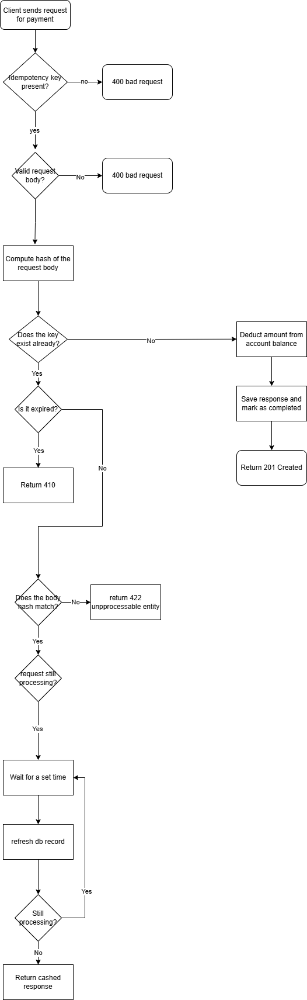

# Idempotency Gateway

A RESTful payment processing API with an idempotency layer that ensures payments are processed **exactly once**, even when clients retry requests due to network failures.

---

## Architecture Diagram



---

## Setup Instructions

### Prerequisites
- Python 3.10+
- pip

### Steps

1. Clone the repository:
   ```bash
   git clone https://github.com/davidberko36/Idempotency-Gateway.git
   cd Idempotency-Gateway
   ```

2. Create and activate a virtual environment:
   ```bash
   python -m venv myenv
   # Windows
   myenv\Scripts\activate
   # Mac/Linux
   source myenv/bin/activate
   ```

3. Install dependencies:
   ```bash
   pip install -r requirements.txt
   ```

4. Create a `.env` file in the root directory:
   ```
   SECRET_KEY=your-secret-key-here
   DEBUG=True
   ```

5. Run migrations:
   ```bash
   cd idempotency_gateway
   python manage.py migrate
   ```

6. Start the server:
   ```bash
   python manage.py runserver
   ```

The API will be available at `http://localhost:8000`.

---

## API Documentation

### Create a User

**POST** `/users/`

Creates a user account with an initial balance.

**Request Body:**
```json
{
    "name": "John Doe",
    "balance": "5000.00"
}
```

**Response `201 Created`:**
```json
{
    "id": 1,
    "name": "John Doe",
    "balance": "5000.00"
}
```

---

### Get User Balance

**GET** `/users/<user_id>/`

Returns the current balance for a user.

**Response `200 OK`:**
```json
{
    "id": 1,
    "name": "John Doe",
    "balance": "4900.00"
}
```

---

### Process a Payment

**POST** `/process-payment/`

Processes a payment against a user account. Requires a unique `Idempotency-Key` header.

**Headers:**

| Header | Required | Description |
|---|---|---|
| `Idempotency-Key` | Yes | A unique string identifying this payment attempt |
| `Content-Type` | Yes | `application/json` |

**Request Body:**
```json
{
    "user_id": 1,
    "amount": 100,
    "currency": "GHS"
}
```

**Response `201 Created` (first request):**
```json
{
    "message": "Charged 100 GHS",
    "user_id": 1,
    "previous_balance": "5000.00",
    "new_balance": "4900.00"
}
```

**Response `201 Created` (duplicate request - same key, same body):**

Same response body as the first request, plus:
```
X-Cache-Hit: true
```

**Error Responses:**

| Status | Scenario |
|---|---|
| `400` | Missing `Idempotency-Key` header, missing/invalid fields, or insufficient balance |
| `404` | User not found |
| `410` | Idempotency key has expired (older than 24 hours) |
| `422` | Same key reused with a different request body |
| `503` | In-flight request timed out |

---

## Design Decisions

### Idempotency via Database Record

Each payment attempt is stored as an `IdempotencyRecord` keyed by the `Idempotency-Key` header. On every request, the server checks for an existing record before processing:

- **No record found** - process the payment and store the response
- **Record found, same body** - return the stored response immediately
- **Record found, different body** - reject with `422` to prevent fraud

The request body is stored as a SHA-256 hash rather than the raw payload to keep storage minimal and make comparisons O(1).

### Race Condition Handling

Django's `get_or_create` wrapped in `transaction.atomic()` is used to atomically claim a `PROCESSING` slot. If a second identical request arrives while the first is still processing, it detects the `PROCESSING` status and polls every 0.5 seconds (up to 15 seconds) until the first request completes, then returns the cached result. This prevents double charges under concurrent retries.

### Balance Deduction with `select_for_update`

The user's balance is updated inside a `select_for_update()` transaction to prevent race conditions between concurrent payments to the same account.

---

## Developer's Choice: Idempotency Key Expiry (TTL)

Each idempotency record is assigned an `expires_at` timestamp 24 hours from creation. Any request that reuses a key older than 24 hours receives a `410 Gone` response.

**Why:** In a real Fintech system, idempotency keys should not be valid forever. Allowing stale keys to replay responses indefinitely could cause confusion (e.g., replaying an old "payment succeeded" response for a new transaction). A 24-hour TTL is a common industry standard — long enough to cover any reasonable retry window, but short enough to keep the store clean and prevent misuse.
